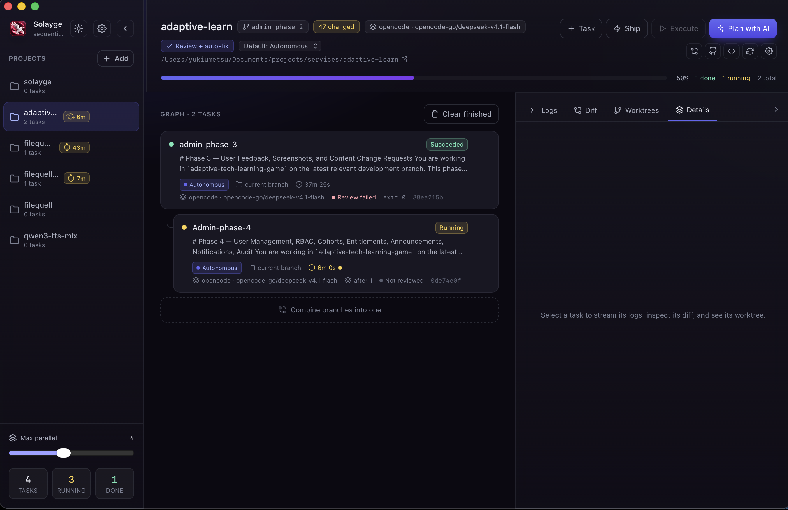

# Solayge



**Orchestrate coding agents as a dependency graph — each task in its own git worktree.**

Solayge is a cross-platform desktop app (macOS, Windows, and Linux) for planning,
running, reviewing, and shipping work by autonomous coding agents. Describe a goal,
review the generated task graph, then run sequential chains or parallel trees while
watching logs, diffs, and progress in one window. When the branches are ready,
combine them, resolve conflicts, test, and ship — from the same graph.

It works with the agent CLIs you already use — **opencode** (default), **Codex**,
**Claude Code**, and **Cursor Agent** — and keeps everything (projects, tasks,
prompts, secrets) on your machine.

[](LICENSE)
[](#requirements)
[](https://tauri.app)
[](https://react.dev)
[](https://www.rust-lang.org)
[](https://www.typescriptlang.org)
[](#contributing)

> **Status:** early development (0.x). The app is usable, but the task and state
> model may still change between releases.

---

## Table of contents

- [Solayge](#solayge)
  - [Table of contents](#table-of-contents)
  - [Why Solayge](#why-solayge)
  - [Features](#features)
    - [Planning \& execution](#planning--execution)
    - [Visibility](#visibility)
    - [Projects](#projects)
    - [Ship](#ship)
  - [Requirements](#requirements)
  - [Getting started](#getting-started)
  - [Concepts](#concepts)
    - [Task](#task)
    - [Separation](#separation)
    - [Task kinds](#task-kinds)
  - [Agents \& models](#agents--models)
  - [Permissions \& safety](#permissions--safety)
  - [Project context](#project-context)
  - [Ship \& Combine](#ship--combine)
    - [Conflict policy](#conflict-policy)
  - [Automatic code review](#automatic-code-review)
  - [Settings \& cache](#settings--cache)
  - [How it works](#how-it-works)
    - [Scheduler](#scheduler)
    - [Data](#data)
    - [Planner output contract](#planner-output-contract)
  - [Repository layout](#repository-layout)
  - [Roadmap](#roadmap)
  - [Contributing](#contributing)
  - [License](#license)
  - [Acknowledgements](#acknowledgements)

## Why Solayge

Coding agents are good at one task and bad at an org chart. Real work is a graph:
a migration before the API change, tests after both, a review, then a release.
Solayge turns that graph into something you can see and control:

- **Isolation by default.** Code-changing tasks default to their own git worktree
  — or a new branch you name — so independent work runs in parallel without
  stepping on other tasks.
- **A graph, not a chat.** Dependencies, delays, and combines are first-class.
- **Nothing runs until you say so.** Tasks are created as drafts; you review the
  plan and press **Execute**.
- **Local and private.** State lives in your app-data directory, secrets are
  encrypted at rest, and nothing is written into your repository.

## Features

### Planning & execution

- **Plan with AI** — describe a goal and the configured agent drafts a task graph
  (a prompt that generates the prompts). Review it, toggle tasks, then execute.
- **Sequential chains** — a task starts only after its dependencies succeed, with
  an optional per-task delay ("start X minutes later").
- **Parallel trees** — independent tasks run concurrently up to a configurable
  limit; the dependency graph is rendered as an indented tree.
- **Drafts & Execute** — new tasks are drafts. Nothing starts until you press
  **Execute** (or start a single task); tasks with dependencies wait their turn.
  Execute also re-queues failed, canceled, and blocked tasks, so you can retry as
  often as you like.
- **Separation per task** — an isolated **worktree**, a **new branch** (named by
  you or the agent), or the **current branch**.
- **Task controls** — start now, cancel, retry, remove worktree, delete, clear
  finished.

### Visibility

- **Streaming logs** — stdout/stderr is streamed from the running process live.
- **Diffs** — a wide, tabbed viewer: per-file diffs of a task's worktree, the
  project working tree, and the current branch against the default branch. Local
  changes is the default tab; the branch tab shows committed work (with an option
  to include uncommitted and untracked files) and each view reports add/modify/
  delete counts. A **Git** tab stages selected or all changed files, commits,
  pushes, creates a PR against the default branch, merges it, and checks out and
  pulls the default branch.
- **Live progress** — status chips, a completion bar, running counters, and
  ticking durations.
- **Past task history** — from a project's empty state, **Show past tasks**
  opens a read-only history of the project's removed tasks — those you delete
  and those **Clear finished** retires — grouped by dependency, with each task's
  prompt, output, diff, and result.
- **Project status at a glance** — the project list shows a spinner and elapsed
  time while tasks run, then failed / blocked / pending / done counts.
- **In review** — a task whose run succeeded but whose automatic code review is
  still queued or running is shown as **In review** (blue, with a pulsing dot)
  and is not counted as done until the review settles.
- **Desktop notifications** when a task finishes, fails, or requests permission.

### Projects

- **Any git repository** — add folders, reorder them, and they're remembered.
- **Per-project agents** — provider, model, and a one-shot backup provider/model.
- **Per-project context** — encrypted environment variables, a system prompt with
  variables, and named skills.
- **Open in your editor** — VS Code, Cursor, Zed, Windsurf, Sublime Text, or the
  system default.

### Ship

- **Ship** — compose an ordered release chain (commit → push → pull request →
  merge → sync) with optional test and CI gates, plus skills and commands.
- **Combine** — merge worktrees/branches in the graph, resolve conflicts, run
  tests, and land the result. The landing branch is explicit and shown before you
  create the task.
- **Manage branches & worktrees** — one Git view lists every branch (and every
  worktree) with whether it is merged into the default branch, and lets you land
  a stranded branch, delete it locally or on the remote, or remove a worktree.
- **Automatic code review** — a reviewer reports, auto-fixes, or stops a task for
  your attention.
- **Interactive questions** — when an agent asks a question or requests
  permission, the task notifies you, shows the question and its options in the
  side panel, and sends your answer back to the live session.

## Requirements

- **macOS, Windows, or Linux**
- **git** on `PATH`
- At least one supported agent CLI on `PATH`:
  - [`opencode`](https://opencode.ai) — default planner and runner
  - [`codex`](https://github.com/openai/codex)
  - [Claude Code](https://claude.com/claude-code) (`claude`)
  - [Cursor Agent](https://cursor.com) (`cursor-agent`)
- **`gh`** (optional) — used to create and merge pull requests; without it the
  PR steps open the compare page in your browser.

> **Windows note.** The agent CLIs (and editors) are launched directly, so they
> must be reachable as native executables on `PATH` (for example opencode's
> Windows installer). If a CLI is only available as a `.cmd`/`.bat` shim (some npm
> installs), wrap it in the command template, e.g.
> `cmd /C claude -p {prompt} [--model {model}]` (Settings → Agent defaults →
> Command templates).

For development you also need **Node + pnpm** and a **stable Rust toolchain**.

## Getting started

```bash
git clone https://github.com/YukiUmetsu/Solayge.git
cd Solayge
pnpm install
pnpm tauri dev      # run the app with hot reload
```

Build a bundle:

```bash
pnpm tauri build    # bundles for the host OS (dmg/app, msi/nsis, deb/rpm/AppImage)
```

Checks used in development:

```bash
pnpm build                     # tsc + vite build (frontend)

cd src-tauri
cargo test                     # unit tests
cargo clippy --all-targets     # lints
```

## Concepts

### Task

A task has a prompt (or a command), a **kind**, a **separation** mode, an optional
delay, and a `depends_on` list. Its status flows:

```
draft → waiting → ready → running → succeeded | failed | canceled | blocked | interrupted
```

- **draft** — created, not yet released (the scheduler ignores it).
- **blocked** — a dependency failed, or a conflict/review needs you.
- **interrupted** — Solayge stopped while the task was running (crash, forced
  quit, out of disk, or a stalled run). The task did not finish; **Retry** (or
  **Execute**) runs it again, and the reason is written into its log. Nothing
  downstream starts until an interrupted dependency is retried.

A task that succeeds is not treated as "done" for its dependents until its
automatic review (if enabled) has finished, so a review or auto-fix can never be
overtaken by the next task.

### Separation

| Mode | Behaviour |
| --- | --- |
| **Worktree** | A dedicated worktree and `devtools/<id>` branch under `<repo>/.dev-tools/worktrees/` (excluded via `.git/info/exclude`). Parallel-safe. |
| **New branch** | Creates a branch in the project folder first. Name it yourself, or leave it blank and the agent suggests a short, unique name. Serialized per project. |
| **Current branch** | Runs in the project folder on its current branch. Serialized per project. |

### Task kinds

Not every step needs an agent. Tasks are one of:

| Kind | What it does |
| --- | --- |
| `agent` | Runs the provider CLI with the prompt (the default). |
| `shell` | Runs a command, with no agent (skills, tests, arbitrary commands). |
| `git` | A built-in op: `add_commit`, `push`, `pr_create`, `pr_merge`, `checkout`, `pull`. |
| `merge` | Combines branches/worktrees, resolves conflicts, tests, and lands. |

Because they are ordinary tasks, they share the tree, dependencies, retries,
cancellation, and live logs.

## Agents & models

Each project inherits account defaults and can override them (**Project settings →
Agent**):

| Setting | Meaning |
| --- | --- |
| Provider + model | Which CLI runs tasks, and the model id passed to it. |
| Backup provider + model | Used **once** if a run exits non-zero (credits, outage, crash). |
| Reviewer provider + model | Which agent reviews (defaults to the task's provider and model). |
| Editor | Which editor the "Open in …" button launches. |

Command templates are editable in **Settings → Agent defaults → Command
templates**, e.g. `claude -p {prompt} [--model {model}]`. `{prompt}` is passed as a
single argument; `{model}` and `{auto}` are substituted; `[ … ]` groups are dropped
when their placeholder is empty.

Model fields are populated from the provider itself where possible (`opencode
models`, `cursor-agent --list-models`, `codex models`) via a refresh button, and
every field also accepts a free-typed model id.

## Permissions & safety

Each task has a permission **profile** (chosen per task, defaulted per project and
account-wide):

| Profile | Behaviour |
| --- | --- |
| `autonomous` (default) | Pre-granted; runs with `--auto`. Hard rails still apply. |
| `supervised` | Reads and edits allowed; shell, network, and external folders ask. With no approver, asks are auto-rejected and surfaced as notifications. |
| `readonly` | Analysis only: reads, glob, grep, search. Edits, shell, and Code Mode (`execute`) are denied. |

The profile is compiled to an [opencode](https://opencode.ai) config and injected
**per run** through `OPENCODE_CONFIG_CONTENT` together with `--standalone`, so the
generated rules actually apply. Nothing is written into the target project. Other
providers currently run without a profile (see the roadmap).

Hard **rails** apply to every profile as non-overridable policies, so neither
`--auto` nor an "Allow always" can lift them: no `sudo`, no `rm -rf /`, no
force-push, and no reads from `~/.ssh`.

Interactive approve/reject is implemented for **opencode**: its tasks run through
the opencode v2 server (`opencode serve`), so the agent's `question` tool and
permission requests are surfaced to Solayge. A question appears in the task's side
panel (option buttons, checkboxes, or free text); a permission request offers
**Allow once / Always allow / Reject**, and `autonomous` tasks auto-approve while
`readonly` tasks auto-reject. The task stays `running` while it waits, so dependents
keep waiting without being failed; a notification fires, and the answer is posted
back to the live session. Other providers still run non-interactively until they
gain adapters (see the [roadmap](#roadmap)).

## Project context

**Project settings** is organised into tabs:

- **General** — the repo path, its `origin` remote, and "Open in …".
- **Agent** — provider, model, backup, review, and editor.
- **Environment** — variables injected into every agent run for the project
  (tasks, reviews, and planning). Values are encrypted at rest; `state.json` only
  records the names. The store is chosen account-wide in **Settings → Secret
  storage**:
  - **OS keychain** — macOS Keychain or Windows DPAPI (not available on Linux).
    The plaintext never touches the app's files.
  - **Encrypted local file** — AES-256-GCM with a random key in `secrets.key`
    (mode `0600`). Convenient, but only as strong as the file.
  - **Automatic** — keychain when the platform has one, otherwise the file.

  Switching stores re-encrypts every saved value and refuses the change if the new
  store is unavailable.
- **Prompt** — a system prompt prepended or appended to every task prompt, with
  variables: `{{project_name}}`, `{{project_path}}`, `{{current_branch}}`, and
  `{{env.NAME}}` (a project env var, then the process environment). Example:
  *"This repo uses pnpm. Never push to `{{current_branch}}` directly."*
- **Skills** — named commands for the project. They are offered to the planner, and
  **Add as task** turns one into a normal task that joins the graph.
- **Git** — how merge conflicts are handled (see [Ship & Combine](#ship--combine)).

Environment variables and the system prompt are applied at run time, so editing them
affects the next run without re-creating tasks.

## Ship & Combine

**Ship** (project header) composes an ordered, editable step list. The defaults are
`commit → push → create PR → merge PR → checkout default branch → pull`; every step
can be toggled, reordered, removed, or joined by a project **skill** or an arbitrary
**command**. Two gates are one click:

- *Tests must pass before the PR is created* — inserts a test step ahead of the PR.
- *PR checks must pass before merging* — inserts `gh pr checks --watch --fail-fast`
  ahead of the merge.

The PR steps use `gh` when installed, and otherwise open the compare / pull-requests
page in your browser. Git steps run on the project's current branch in the project
folder.

**Combine** lives in the graph: use *Combine branches* above the task tree (or the
dashed node at its end) to create one `merge` task from selected task branches plus
any branch names you type. The dialog shows exactly where it will land — the target
branch is a real dropdown with the default branch preselected, not a blank that
silently resolves at run time. It waits for those tasks to succeed, then checks out
the target, merges each source (merge / octopus / rebase), runs the test command,
and can push the target. A failed test can be handed to an agent to fix and re-run.

Only committed work is merged, so before it lands the combine inspects every
source's worktree. If any of them has uncommitted work, the dialog warns you and
offers to stage and commit it first (on by default) — otherwise those changes would
be silently left out. The same check runs again when the task starts; a source that
is still dirty and not being committed is called out in the task log.

### Conflict policy

Set per project (**Project settings → Git**):

| Mode | Behaviour |
| --- | --- |
| **Stop and wait for me** (default) | The task blocks on the conflict. Resolve it in the project folder, then Retry. |
| **Agent resolves, then wait for me** | An agent resolves and commits, then the task blocks for your review before Retry continues. |
| **Agent resolves and continues** | An agent resolves and the workflow carries on. |

Blocked tasks hold back anything that depends on them. Retrying is safe: a combine
task is idempotent, so branches already merged report *"already up to date"*.

### Managing branches & worktrees

The **Git** view (the diff/branch icon in the project header) is a small Git
manager with tabs for local changes, the current branch's diff, **Branches**,
**Worktrees**, and **Changes** (stage, commit, push, ship). Diffs are
syntax-highlighted by file type, with added/deleted lines tinted and marked, and
**Open all** / **Close all** controls for the file list.

- **Branches** lists every local branch (plus remote-only ones) and answers the one
  question a worktree-based workflow can silently get wrong: *has this landed?*
  Each row shows **Merged** or **Not merged** against the default branch, with how
  far it is ahead/behind and any worktree using it. A branch that has not landed
  gets a **Merge into `<default>`** button (a local merge into the default branch).
  Branches can be deleted locally, on the remote, or both at once; **Delete
  merged** removes every merged branch in one go. The default branch never shows
  delete controls, and deletions refuse the checked-out branch and any branch a
  worktree holds.
- **Worktrees** lists the linked worktrees with the same landing state and offers
  **Remove worktree**, **Delete branch**, **Delete remote**, and **Delete local +
  remote**, plus **Remove merged** to clear every merged worktree (and its merged
  branch) at once.

Merging from here checks out the target first, refuses a dirty working tree, and
aborts (rather than leaving the project mid-conflict) if the merge conflicts.

## Automatic code review

With review enabled, a reviewer runs in the task's worktree after it succeeds and
must end with `REVIEW: PASS` or `REVIEW: ISSUES: <summary>`. The verdict is stored
on the task (a badge on the card, the full log on the **Review** tab). Tasks that
depend on it do not start until the review — and any auto-fix — has finished. The
reviewer uses the same provider and model as the task unless you configure a
different one, so it runs under the same account and subscription. Modes:

- **Off** — no review.
- **Review only** — record a verdict; never blocks.
- **Review + auto-fix** — fix problems the reviewer finds, then continue.
- **Review, then stop on issues** — block the task, holding back dependents.

The mode can be set account-wide or per project.

## Settings & cache

Open **Settings** from the gear in the sidebar:

- **Appearance** — System / Light / Dark.
- **Default permissions** — fallback profile for projects without their own.
- **Secret storage** — where encrypted environment values live.
- **Agent defaults** — provider, model, backup, review, editor, command templates.
- **Cache** — retention (7 days … 1 year, or forever), live stats, and buttons to
  clear prompt history, task logs, or everything.

Prompts you write for tasks and planner goals are cached and offered as one-click
suggestions in **New task** and **Plan with AI**. Task logs are treated as cache
too. Both are pruned on launch, when settings change, and after new tasks are
created; logs of running tasks are never removed. Projects and task history are
always kept.

## How it works

### Scheduler

A 1-second loop in the Rust core:

1. **Reap** finished child processes and finalize their status.
2. **Promote** waiting tasks to ready when all dependencies succeeded and the delay
   has elapsed; mark them `blocked` if a dependency failed or was interrupted.
3. **Dispatch** ready tasks in creation order while the running count is below the
   concurrency limit, serializing shared, git, and merge tasks per project.

Starting a task prepares its worktree/branch, spawns the provider CLI (or a shell
command, or the built-in git op), streams stdout/stderr to a log file and the UI,
and records the exit code. Integration (`merge`) tasks run a small orchestrator that
drives one child process at a time and can hand conflicts or failing tests to an
agent. opencode agent tasks instead run through a managed `opencode serve`
process: the scheduler creates a session, sends the prompt, polls for output, and
surfaces questions or permission asks (see [Permissions & safety](#permissions--safety)).
It falls back to the non-interactive `opencode run` CLI if the server cannot start.

**Recovery.** Each tick is supervised: a panic in one tick is logged to
`logs/scheduler.log` and the loop keeps running. Locks are poison-tolerant, so one
bad tick cannot wedge the app. Every run reports a heartbeat while its child is
alive or its output is streaming; a run that goes silent is marked `interrupted`.
On startup, any task left `running` is marked `interrupted` with a note in its log,
and reviews left queued or running are re-run — so state after a crash or forced
quit is never stuck. A new attempt appends to the log rather than truncating it, so
the previous failure stays readable.

### Data

- App state (projects, tasks, concurrency, settings, prompt cache): `state.json`
  in the platform app-data directory —
  - macOS: `~/Library/Application Support/com.solayge.desktop/`
  - Windows: `%APPDATA%\com.solayge.desktop\`
  - Linux: `~/.local/share/com.solayge.desktop/`
- Per-task logs: `<app data dir>/logs/<task-id>.log`
- Scheduler/crash log: `<app data dir>/logs/scheduler.log`
- Worktrees: `<project>/.dev-tools/worktrees/<short-id>` (branch `devtools/<short-id>`)
- Secrets: never in `state.json` — either the OS keychain (macOS/Windows) or
  `<app data dir>/secrets.json` (AES-256-GCM; key in `secrets.key`, mode `0600`)

On first launch, if the new state is empty, the app imports the data folder from a
previous bundle identifier (`com.solayge.app`, or `com.devtools.orchestrator` before
the rename) so nothing is lost.

### Planner output contract

The planner asks the model for a single JSON object:

```json
{
  "summary": "…",
  "tasks": [
    {
      "id": "t1",
      "title": "…",
      "prompt": "…",
      "isolation": "worktree",
      "after": ["t0"],
      "delay_seconds": 0
    }
  ]
}
```

`after` references other task ids in the plan; the app remaps them to persisted ids
when you create the plan.

## Repository layout

```
src/                  React + TypeScript frontend
  components/         UI (sidebar, task graph, detail panel, modals)
  lib/                providers, models, formatting helpers, theme
  api.ts, types.ts    Tauri command bindings and shared types
src-tauri/            Tauri app (Rust)
  src/commands.rs     Tauri command surface
  src/scheduler.rs    dispatch loop and task execution (agent/shell/git/merge)
  src/agent.rs        provider commands, prompt templating, review
  src/permissions.rs  permission profiles and hard rails
  src/git.rs          repository/worktree/diff operations
  src/secrets.rs      encrypted-at-rest secret store
  src/models.rs       persisted data model
  src/state.rs        app state and persistence
  src/cache.rs        prompt/log retention
  src/opencode.rs     planner integration
  tauri.conf.json     window, bundle, and security configuration
```

## Roadmap

1. ~~Permission profiles, rails, and notifications~~ — done.
2. **Server runner** — drive tasks through the opencode server API for interactive
   approve/reject and steerable sessions (interrupt, queue prompts), and apply
   permission profiles to providers other than opencode. *opencode is done; Claude
   Code (stream-json control protocol) and the remaining providers are next.*
3. **Control plane** — an authenticated HTTP/WS API, bound to the Tailscale
   interface, for a mobile client.
4. **Mobile client** — monitor, steer, and approve over the tailnet.

## Contributing

Contributions are welcome — issues, ideas, and pull requests.
Especially Windows, Linux, Claude code, Codex testers, contributors would be appreciated.

1. Fork the repo and create a branch.
2. `pnpm install` and `pnpm tauri dev`.
3. Keep the checks green:
   ```bash
   pnpm build
   (cd src-tauri && cargo test && cargo clippy --all-targets)
   ```
4. Open a pull request describing the change and how you tested it.

Please keep changes consistent with the existing structure and style, and add a
short note to the README when you add user-facing behaviour.

## License

Released under the [MIT License](LICENSE).

## Acknowledgements

Built with [Tauri](https://tauri.app), [React](https://react.dev),
[Vite](https://vite.dev), [Tailwind CSS](https://tailwindcss.com), and
[Rust](https://www.rust-lang.org) — and it would be nothing without the agent CLIs
it drives: [opencode](https://opencode.ai), [Codex](https://github.com/openai/codex),
[Claude Code](https://claude.com/claude-code), and
[Cursor Agent](https://cursor.com).
